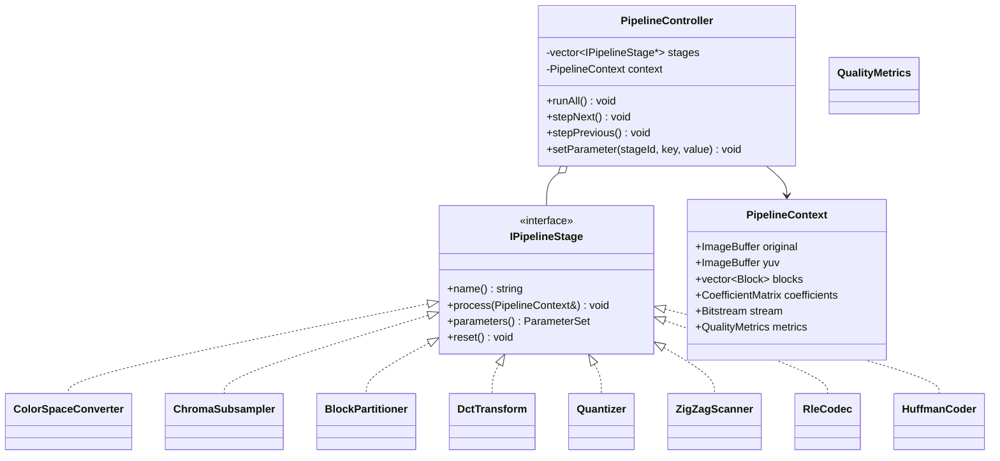

# Architecture

## Interactive Video Codec Visualizer

## 1. Layering and Dependency Rule

The system is layered with a strict dependency rule: Presentation depends on Application, Application depends on Core, and Core depends on nothing project-specific other than Eigen/OpenCV/the standard library. This is what lets every module be unit-tested headlessly and, later, reused in a WASM/web build without dragging Qt along.

```
+-----------------------------------------------------------+
|  Presentation (Qt)                                         |
|  MainWindow, ModuleViews (RgbYuvView, DctView, ...),        |
|  Widgets (MatrixHeatmapWidget, BlockGridWidget, ...)        |
+-----------------------------------------------------------+
|  Application / Orchestration                                |
|  PipelineController, PipelineContext, StageRegistry,         |
|  Commands (Undo/Redo), ParameterViewModels                  |
+-----------------------------------------------------------+
|  Core Algorithms (pure C++20, no Qt)                         |
|  ColorSpace, ChromaSubsampler, BlockPartitioner,              |
|  Transform (DCT), Quantizer, ZigZagScanner, RleCodec,         |
|  HuffmanCoder, MotionEstimator, IntraPredictor,               |
|  DeblockingFilter, QualityMetrics, BitstreamWriter            |
+-----------------------------------------------------------+
|  Data Model                                                   |
|  ImageBuffer<T>, FrameBuffer, Block, CoefficientMatrix,        |
|  MotionVector, Bitstream                                      |
+-----------------------------------------------------------+
|  Platform / IO                                                 |
|  OpenCV (decode/encode), FileSystem, Logging (spdlog)           |
+-----------------------------------------------------------+
```

## 2. Core Abstraction: IPipelineStage

Every pipeline stage (color conversion, subsampling, DCT, quantization, and so on) implements a common interface so the `PipelineController` can sequence, replay, or step through stages uniformly, and the UI can bind to any stage's input/output buffers without knowing its internals. Adding a new module later means implementing this one interface and registering it; the controller and UI shell are never modified.



## 3. Data Flow (still-image pipeline, v1)


## 4. Design Patterns Applied

- Strategy: interchangeable algorithms within a stage (e.g. different subsampling filters, different entropy coders).
- Observer: the parameter panel and metrics panel react to `PipelineContext` changes without polling.
- Command: step-forward/back and undo of parameter changes.
- Factory: stage instances are constructed from a `StageRegistry` so new modules self-register, instead of the controller growing a switch statement.
- Dependency Injection: `IPipelineStage` implementations are constructor-injected into the controller, keeping it testable with mock stages.

## 5. UI Architecture

The main shell is a docked layout: a pipeline stage list on the left, an active module canvas in the center, and parameter/metrics panels on the right, with a step/run transport bar at the bottom. Every module view follows the same relative layout (input top-left, output/transform top-right, secondary visualization bottom-left, numeric/interactive detail bottom-right) so users build a spatial habit across modules instead of relearning a new layout per stage. See the module wireframes in the Stage 0 design discussion (reproduced per-module in each module's design doc under `docs/modules/` as it is implemented).

## 6. Extensibility Notes

- New still-image stages: implement `IPipelineStage`, add a folder under `modules/`, register with `StageRegistry`, add a `ModuleView` in `ui/`.
- Video pipeline (v2): introduces a `FrameSequence` data model distinct from single-image `PipelineContext`; motion estimation/compensation, intra/inter prediction, and deblocking build on top of it without modifying the still-image stages.
- Web/WASM export (v3+, tentative): only `core/` needs to compile under Emscripten; `app/` and `ui/` (Qt) are not part of that build target.

## 7. Known Technical Debt / Open Risks

- `PipelineContext` as a single shared mutable struct is simple but can become a god-object as more stages are added; if it grows unwieldy we will split it into per-stage-group contexts (documented here rather than silently reworked).
- Qt Graphics View performance for very large images (beyond a few thousand pixels per side) is untested; tiling/level-of-detail rendering may be needed later.
- No plugin system yet for third-party-contributed modules; the `StageRegistry` factory pattern is designed to support one later without a rewrite.
